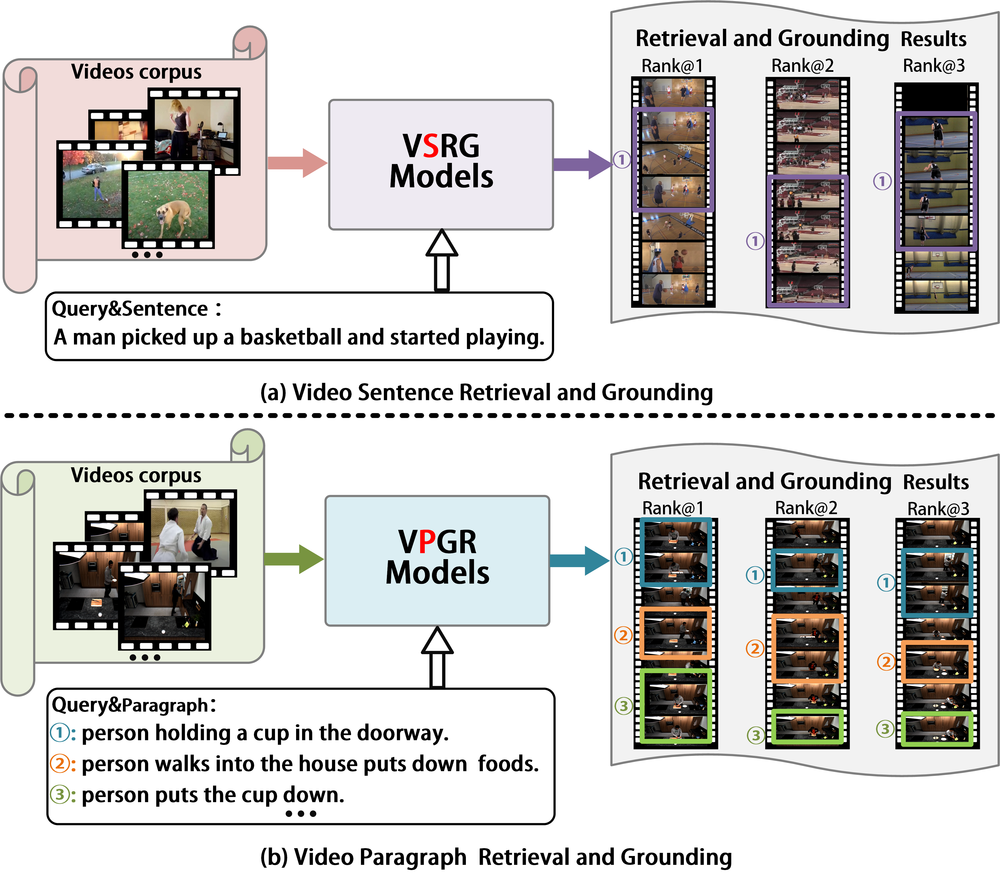

# Dual-task Mutual Reinforcing Embedded Joint Video Paragraph Retrieval and Grounding

<div align="center">
    
</div>

Abstract:Video Paragraph Grounding (VPG) aims to precisely locate the most appropriate moments within a video that are relevant to a given textual paragraph query. However, existing methods typically rely on large-scale annotated temporal labels and assume that the correspondence between videos and paragraphs is known. This is impractical in real-world applications, as constructing temporal labels requires significant labor costs, and the correspondence is often unknown. To address this issue, we propose a Dual-task Mutual Reinforcing Embedded Joint Video Paragraph Retrieval and Grounding method (DMR-JRG). In this method,  retrieval and grounding tasks are mutually reinforced rather than being treated as separate issues. DMR-JRG mainly consists of two branches: a retrieval branch and a grounding branch. The retrieval branch uses inter-video contrastive learning to roughly align the global features of paragraphs and videos, reducing modality differences and constructing a coarse-grained feature space to break free from the need for correspondence between paragraphs and videos. Additionally, this coarse-grained feature space further facilitates the grounding branch in extracting fine-grained contextual representations. In the grounding branch, we achieve precise cross-modal matching and grounding by exploring the consistency between local, global, and temporal dimensions of video segments and textual paragraphs. By synergizing these dimensions, we construct a fine-grained feature space for video and textual features, greatly reducing the need for large-scale annotated temporal labels. Meanwhile, we design a grounding reinforcement retrieval module (GRRM) that brings the coarse-grained feature space of the retrieval branch closer to the fine-grained feature space of the grounding branch, thereby reinforcing retrieval branch through grounding branch, and finally achieving mutual reinforcement between tasks. Extensive experiments on three challenging datasets demonstrate the effectiveness of our proposed method.


## News
- :beers: Our paper has been submitted to the TMM.

## Framework


## Main Results


#### Main results on ActivityNet Captions and Charades-STA


#### Main results on TACoS

<div align="center">
    
</div>

### Data Preparation
Please download the visual features from [here](https://pan.baidu.com/s/1_JiOUG3FKkKXij-0kVfkuA?pwd=ryeh) and save it to the `data/` folder. We expect the directory structure to be the following:

```
data
├── activitynet
│   ├── sub_activitynet_v1-3.c3d.hdf5
│   ├── glove.pkl
│   ├── train_data.json
│   ├── val_data.json
│   ├── test_data.json

```

## Prerequisites
- python 3.5
- pytorch 1.4.0
- torchtext
- easydict
- terminaltables

## Training
Use the following commands for training:
```
cd moment_localization && export CUDA_VISIBLE_DEVICES=0
python dense_train.py --verbose --cfg ../experiments/dense_activitynet/acnet.yaml
```
## test
Use the following commands for test:
```
cd moment_localization && export CUDA_VISIBLE_DEVICES=0
python best_test.py --verbose --cfg ../experiments/dense_activitynet/acnet.yaml
```

We also provide several checkpoints for reproducing our experiment results. You can download them from [baidu drive](https://pan.baidu.com/s/1xWC90AIDImVJfKV9qcah4Q), put them under ```save/``` and use the above scripts to evaluate them.


## e-mail

call me: mengzhaowangg@163.com
